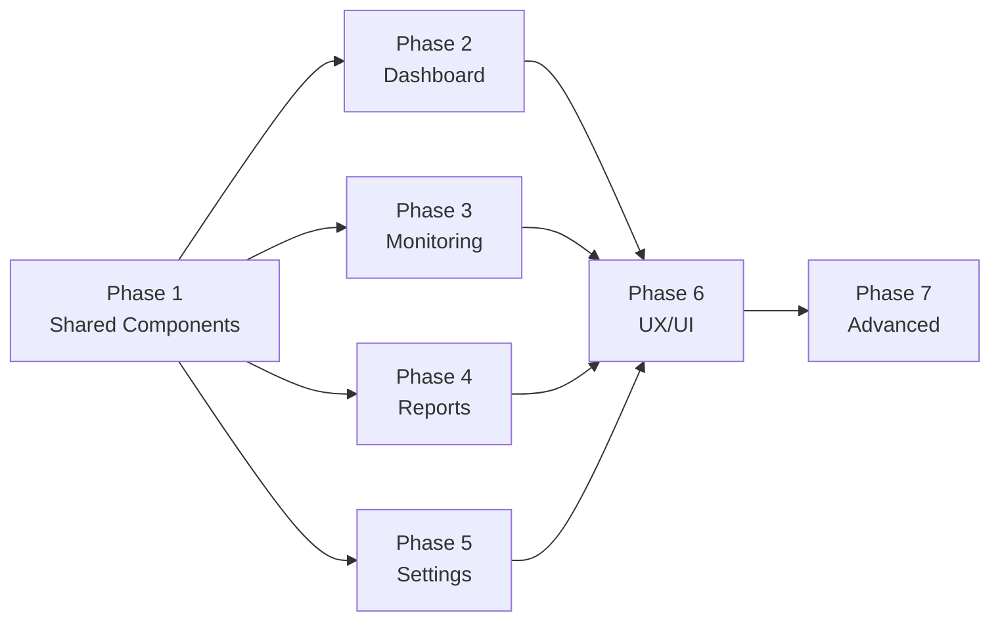

# 🚀 แผนการทำงาน Frontend — EnergyPlus

> เอกสารนี้คือ Step-by-step สำหรับพัฒนา Frontend ต่อจากที่ทำไว้

---

## ภาพรวม

```
Phase 1 → Shared Components & API Client
Phase 2 → Dashboard Pages (3 หน้า)
Phase 3 → Monitoring Pages (3 ฟีเจอร์)
Phase 4 → Report Pages (4 หน้า)
Phase 5 → Settings Pages (2 หน้าใหม่)
Phase 6 → UX/UI Improvements
Phase 7 → Advanced Features
```

---

## Phase 1: Shared Components & API Client 🧩

> ต้องทำก่อน เพราะทุก Phase ใช้ร่วมกัน

### Step 1.1 — สร้าง Shared Filter Bar Component
- **ไฟล์**: `src/components/ui/FilterBar.tsx`
- ใช้ซ้ำได้ทุกหน้า (Monitoring, Reports, Dashboard)
- รองรับ: Date range picker, Dropdown (ประเภท/Site/Building/Zone), Search, ปุ่ม Show Data

### Step 1.2 — สร้าง Export Button Components
- **ไฟล์**: `src/components/ui/ExportButtons.tsx`
- ปุ่ม Export Excel / Export Text / Export PDF
- เรียก API download + trigger browser download

### Step 1.3 — เพิ่ม API Client functions
- **ไฟล์**: `src/api/client.ts`
- เพิ่ม:
  ```
  reportsApi     → energy, history, comparison, alarms
  layoutsApi     → getAll, create, update, delete, getPositions, getLive
  exportApi      → getConfigs, create, update, delete
  demandPeakApi  → getData, getCurrent
  ```

### Step 1.4 — สร้าง Status Badge Component
- **ไฟล์**: `src/components/ui/StatusBadge.tsx`
- Normal (เขียว) / Disconnect (แดง) / Warning (เหลือง) / Active (เขียว)

---

## Phase 2: Dashboard Pages 📊

> API พร้อมแล้ว ทำได้เลย

### Step 2.1 — MDB Consumption Dashboard
- **ไฟล์**: `src/pages/dashboard/MdbDashboard.tsx`
- **ขั้นตอน**:
  1. สร้าง page component
  2. เพิ่ม Filter bar (Site, Period)
  3. เรียก `dashboardApi.getMdbConsumption()`
  4. แสดง Bar Chart (react-chartjs-2)
  5. แสดงตาราง summary ด้านล่าง
  6. อัพเดท `App.tsx` — แทน PlaceholderPage

### Step 2.2 — Demand Dashboard
- **ไฟล์**: `src/pages/dashboard/DemandDashboard.tsx`
- **ขั้นตอน**:
  1. สร้าง page component
  2. เรียก `dashboardApi.getDemand()`
  3. แสดง Line Chart + threshold lines (Warning/Peak)
  4. แสดง Gauge chart (current demand)
  5. อัพเดท `App.tsx`

### Step 2.3 — Consumption Table
- **ไฟล์**: `src/pages/dashboard/ConsumptionTable.tsx`
- **ขั้นตอน**:
  1. สร้าง page component
  2. เพิ่ม FilterBar (Site/Building/Zone/Period)
  3. เรียก `dashboardApi.getConsumptionTable()`
  4. แสดง DataTable + Pagination
  5. ปุ่ม Export to Excel
  6. อัพเดท `App.tsx`

---

## Phase 3: Monitoring Pages 📡

### Step 3.1 — ปรับปรุง Realtime Monitoring
- **ไฟล์**: `src/pages/monitoring/RealtimePage.tsx` (แก้ไข)
- **ขั้นตอน**:
  1. เพิ่ม FilterBar ด้านบน (ประเภท, Site, Building, Zone, โปรไฟล์)
  2. ปุ่ม "Show Data"
  3. เพิ่มคอลัมน์: สถานะ (DisConnect badge), KW1-KW3, KVAh, กราฟ icon
  4. เพิ่ม Pagination (รองรับ 420+ entries)
  5. Status badge: Normal / Disconnect

### Step 3.2 — สายทาง (Single Line Diagram)
- **ไฟล์**: `src/pages/monitoring/LayoutPage.tsx` (ใหม่)
- **ขั้นตอน**:
  1. สร้าง page component
  2. Dropdown เลือก Building
  3. แสดง floor plan image จาก API
  4. Overlay meter positions บน image (absolute positioning)
  5. สีตาม status (เขียว=ปกติ, แดง=disconnect)
  6. Panel ด้านขวา: แสดง Energy (KWh)
  7. แสดง datetime realtime
  8. เพิ่ม route + menu ใน Sidebar

### Step 3.3 — พยากรณ์ Demand Peak
- **ไฟล์**: `src/pages/monitoring/DemandPeakPage.tsx` (ใหม่)
- **ขั้นตอน**:
  1. สร้าง page component
  2. Date range picker + Filters (Site, Building, Zone, Search Meter)
  3. ปุ่ม "Show Data"
  4. เรียก API + แสดงกราฟ/ตาราง
  5. เพิ่ม route + menu ใน Sidebar

---

## Phase 4: Report Pages 📋

### Step 4.1 — การใช้พลังงานตามช่วงเวลา
- **ไฟล์**: `src/pages/reports/EnergyReportPage.tsx` (ใหม่)
- **ขั้นตอน**:
  1. FilterBar: Date range, ประเภท, Site, Building, Zone
  2. ปุ่ม Show Data, Export Excel, Export Text
  3. DataTable: รหัสมิเตอร์, ชื่อลูกค้า, อาคาร, ชั้น, สถานที่, วันที่เริ่ม/สิ้นสุด, จำนวนหน่วย, ราคา, จำนวนเงิน
  4. อัพเดท `App.tsx` แทน PlaceholderPage

### Step 4.2 — ข้อมูลพลังงานย้อนหลัง
- **ไฟล์**: `src/pages/reports/HistoryReportPage.tsx` (ใหม่)
- **ขั้นตอน**:
  1. FilterBar: Date range, ประเภท, Site, Building, Zone, Search Meter
  2. ปุ่ม Show Data, Export
  3. DataTable: วันที่, KWh, Kva, Kw, Kvar, Frequency, PWL1-3, KW1-3, KWAh, KVARh, Volt, Amp...
  4. Horizontal scroll (คอลัมน์เยอะ)

### Step 4.3 — เปรียบเทียบเดือนก่อน
- **ไฟล์**: `src/pages/reports/ComparisonReportPage.tsx` (ใหม่)
- **ขั้นตอน**:
  1. FilterBar: เดือน/ปี, ประเภท, Site, Building, Zone
  2. ปุ่ม Show Data, Export
  3. DataTable: มิเตอร์, อาคาร, โซน, ห้อง, เดือน(1), หน่วย(1), เดือน(2), หน่วย(2), **% เปรียบเทียบ**
  4. Highlight สี % (แดง=ใช้มากขึ้น, เขียว=ใช้น้อยลง)

### Step 4.4 — ข้อมูลการแจ้งเตือน
- **ไฟล์**: `src/pages/reports/AlarmReportPage.tsx` (ใหม่)
- **ขั้นตอน**:
  1. FilterBar: Date range
  2. ปุ่ม Show Data
  3. DataTable: วันที่, ข้อความ, วันเวลาเกิด, ประเภท, วันเวลาแก้ไข, ผู้แก้ไข
  4. ปุ่ม Acknowledge (สีเหลือง) แต่ละ row
  5. Pagination

---

## Phase 5: Settings Pages (2 หน้าใหม่) ⚙️

### Step 5.1 — ตั้งค่าภาพแผนผังสถานที่
- **ไฟล์**: `src/pages/settings/LayoutSettingsPage.tsx` (ใหม่)
- **ขั้นตอน**:
  1. DataTable: Name, Image Name, Image (thumbnail), Position, Actions
  2. ปุ่ม "+ Create New"
  3. Modal form: ชื่อ, Upload image, Position
  4. CRUD operations
  5. เพิ่ม route + Sidebar menu

### Step 5.2 — ตั้งค่าการ Export
- **ไฟล์**: `src/pages/settings/ExportSettingsPage.tsx` (ใหม่)
- **ขั้นตอน**:
  1. DataTable: Name, ExportPath, ScheduleEvery, Active, ผู้สร้าง, วันที่สร้าง, ผู้แก้ไข, วันที่แก้ไข, Actions
  2. ปุ่ม "+ Create New"
  3. Modal form: ชื่อ, Path, Schedule
  4. CRUD operations
  5. เพิ่ม route + Sidebar menu

---

## Phase 6: UX/UI Improvements 🎨

### Step 6.1 — Route Guard
- แก้ไข `App.tsx` — ครอบ Protected Route component
- Redirect ไป `/login` ถ้าไม่มี token

### Step 6.2 — Default Route
- เปลี่ยนจาก `/admin/company` → `/dashboard/zone`

### Step 6.3 — Sidebar Active State
- แก้ไข `Sidebar.tsx` — highlight menu ปัจจุบัน

### Step 6.4 — Error Handling
- สร้าง Toast notification component
- Error boundary + Empty state

### Step 6.5 — Loading & Breadcrumb
- Skeleton loading
- Breadcrumb navigation

---

## Phase 7: Advanced Features 🚀

- WebSocket (Socket.IO) real-time
- Dark Mode toggle
- i18n (ไทย/English)
- Notification Center

---

## ลำดับการทำงาน (Dependency)



---

## ไฟล์ที่ต้องสร้าง/แก้ไข (สรุป)

| ประเภท | ไฟล์ | หมายเหตุ |
|--------|------|---------|
| 🆕 Component | `FilterBar.tsx` | Shared filter bar |
| 🆕 Component | `ExportButtons.tsx` | Export Excel/Text/PDF |
| 🆕 Component | `StatusBadge.tsx` | Status indicator |
| ✏️ API | `client.ts` | เพิ่ม reportsApi, layoutsApi, exportApi |
| 🆕 Dashboard | `MdbDashboard.tsx` | MDB consumption |
| 🆕 Dashboard | `DemandDashboard.tsx` | Demand chart |
| 🆕 Dashboard | `ConsumptionTable.tsx` | Consumption data table |
| ✏️ Monitoring | `RealtimePage.tsx` | เพิ่ม filter + columns |
| 🆕 Monitoring | `LayoutPage.tsx` | Single line diagram |
| 🆕 Monitoring | `DemandPeakPage.tsx` | Demand Peak forecast |
| 🆕 Report | `EnergyReportPage.tsx` | พลังงานตามช่วงเวลา |
| 🆕 Report | `HistoryReportPage.tsx` | พลังงานย้อนหลัง |
| 🆕 Report | `ComparisonReportPage.tsx` | เปรียบเทียบเดือน |
| 🆕 Report | `AlarmReportPage.tsx` | ข้อมูลแจ้งเตือน |
| 🆕 Settings | `LayoutSettingsPage.tsx` | ตั้งค่าแผนผัง |
| 🆕 Settings | `ExportSettingsPage.tsx` | ตั้งค่า Export |
| ✏️ Router | `App.tsx` | เพิ่ม routes ทั้งหมด |
| ✏️ Layout | `Sidebar.tsx` | เพิ่ม menu items |

> **รวม: 14 ไฟล์ใหม่ + 4 ไฟล์แก้ไข = 18 ไฟล์**

---

## Verification Plan

### ทดสอบแต่ละ Phase
1. **TypeScript Build** — `npm run build` ต้องผ่านไม่มี error
2. **Visual Test** — เปิด browser ตรวจทุกหน้าว่า render ถูกต้อง
3. **API Integration** — ทดสอบกับ backend จริง ว่าข้อมูลแสดงถูก
4. **Responsive** — ทดสอบ mobile viewport
5. **Navigation** — ทุก route / menu link ใช้งานได้

### Manual Testing (ให้ user ทดสอบ)
1. เปิด `http://localhost:5173`
2. Login ด้วย user/pass ของระบบเก่า
3. คลิกเมนูทุกหน้า — ตรวจสอบว่า UI ตรงกับระบบเก่า
4. ทดสอบ Filter + Show Data
5. ทดสอบ Export Excel/Text
