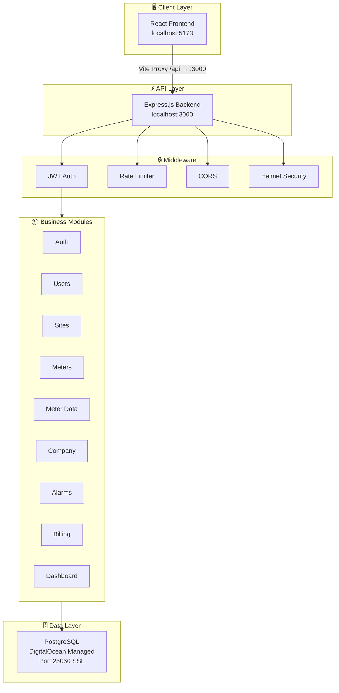
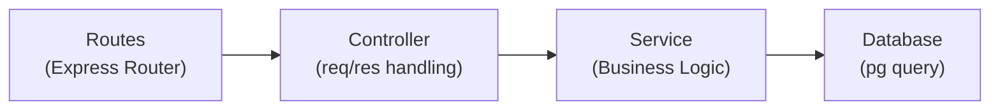
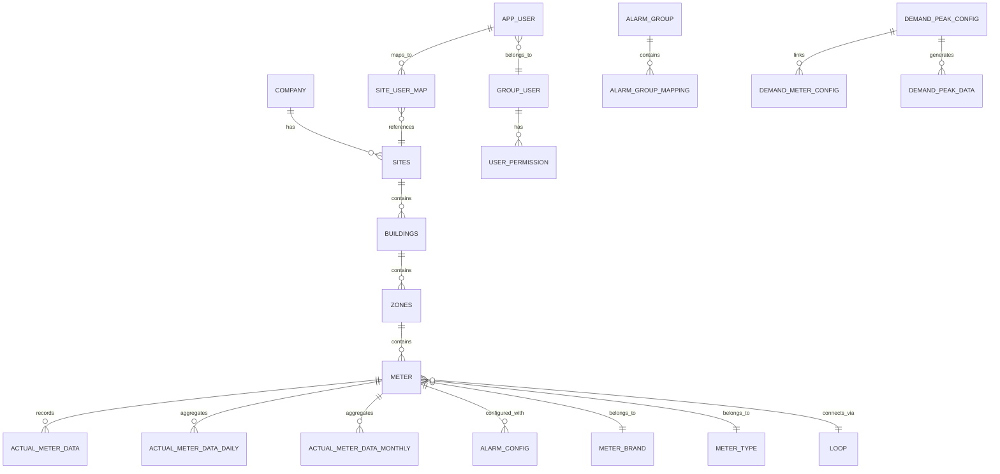
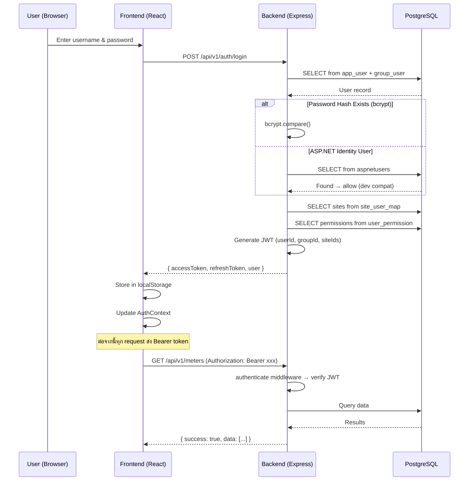
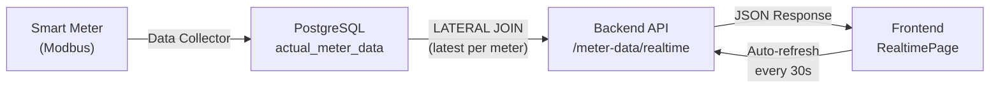

# 📘 EnergyPlus — Project Documentation

> **ระบบตรวจสอบและจัดการพลังงาน (Energy Monitoring & Management System)**
> สำหรับบริษัท MAC Energy / KE Group — เวอร์ชัน 2.0

---

## 📋 สารบัญ

1. [ภาพรวมโปรเจค](#1-ภาพรวมโปรเจค)
2. [Technology Stack](#2-technology-stack)
3. [สถาปัตยกรรมระบบ](#3-สถาปัตยกรรมระบบ)
4. [โครงสร้างไฟล์](#4-โครงสร้างไฟล์)
5. [Backend — รายละเอียด](#5-backend--รายละเอียด)
6. [Frontend — รายละเอียด](#6-frontend--รายละเอียด)
7. [Database Schema](#7-database-schema)
8. [API Endpoints](#8-api-endpoints)
9. [Authentication Flow](#9-authentication-flow)
10. [Data Flow & Patterns](#10-data-flow--patterns)
11. [สถานะการพัฒนา](#11-สถานะการพัฒนา)
12. [วิธี Run โปรเจค](#12-วิธี-run-โปรเจค)
13. [Environment Variables](#13-environment-variables)

---

## 1. ภาพรวมโปรเจค

**EnergyPlus** เป็นระบบ **Energy Monitoring & Management** ที่ใช้ตรวจสอบการใช้พลังงานไฟฟ้า, น้ำ, แก๊ส ของอาคารและสถานที่ต่างๆ แบบ Real-time ผ่าน Smart Meter (Modbus Protocol)

### วัตถุประสงค์หลัก

| เป้าหมาย | รายละเอียด |
|-----------|-----------|
| 📊 **Monitoring** | ติดตามการใช้พลังงานแบบ Real-time จาก Smart Meter |
| 🔔 **Alerting** | แจ้งเตือนผ่าน Telegram เมื่อค่าพลังงานเกินเกณฑ์ |
| 📈 **Analytics** | Dashboard วิเคราะห์การใช้พลังงานตามโซน, อาคาร, ช่วงเวลา |
| 📋 **Reporting** | ออกรายงานการใช้พลังงาน, เปรียบเทียบเดือน, ย้อนหลัง |
| 💰 **Billing** | คำนวณค่าไฟตามอัตราค่าหน่วย (TOU/Flat Rate) |
| ⚡ **Demand Peak** | ติดตามและพยากรณ์ Demand Peak เพื่อลดค่าไฟ |

### ที่มาของโปรเจค

โปรเจคนี้เป็นการ **Rewrite** จากระบบเดิมที่เป็น **ASP.NET MVC (C#)** ที่โฮสต์อยู่ที่ `energyplus.kegroup.co.th:5500` โดยเปลี่ยนมาใช้ **Node.js + React (TypeScript)** เพื่อ:
- ปรับปรุง Performance (Event-driven สำหรับ Real-time data)
- ทำ Frontend ใหม่ให้ทันสมัย (React + Ant Design)
- ใช้ Database เดิม (PostgreSQL บน DigitalOcean) ร่วมกันได้

---

## 2. Technology Stack

### Backend

| Layer | Technology | เวอร์ชัน | หน้าที่ |
|-------|-----------|---------|--------|
| Runtime | Node.js | 20 LTS | JavaScript runtime |
| Framework | Express.js | 4.21 | Web framework |
| Language | TypeScript | 5.6 | Type safety |
| Database | PostgreSQL | Managed | DigitalOcean Managed DB |
| DB Driver | pg (node-postgres) | 8.13 | PostgreSQL client |
| Auth | jsonwebtoken | 9.0 | JWT-based authentication |
| Password | bcryptjs | 2.4 | Password hashing |
| Security | helmet | 7.1 | HTTP security headers |
| CORS | cors | 2.8 | Cross-origin resource sharing |
| Rate Limit | express-rate-limit | 7.4 | API rate limiting |
| Logging | morgan | 1.10 | HTTP request logging |
| Dev Server | nodemon + ts-node | — | Hot reload development |

### Frontend

| Layer | Technology | เวอร์ชัน | หน้าที่ |
|-------|-----------|---------|--------|
| Framework | React | 18.3 | UI library |
| Language | TypeScript | 5.6 | Type safety |
| Build Tool | Vite | 5.4 | Dev server & bundler |
| Routing | react-router-dom | 6.27 | Client-side routing |
| HTTP Client | Axios | 1.7 | API calls |
| UI Library | Ant Design (antd) | 5.21 | UI component library |
| Charts | Chart.js + react-chartjs-2 | 4.5 / 5.3 | Bar, Pie, Line charts |
| Charts (alt) | Recharts | 2.13 | Alternative charting |
| Icons | Lucide React + React Icons + @ant-design/icons | — | Icon sets |

---

## 3. สถาปัตยกรรมระบบ



### การสื่อสารระหว่าง Frontend ↔ Backend

- Frontend (Vite) มี **Proxy Config** ที่ forward `/api/*` ไปยัง `http://localhost:3000`
- ทุก API request ส่ง **JWT Bearer Token** ผ่าน Authorization header
- Response format เป็น standard wrapper: `{ success, data, message, pagination, meta }`

---

## 4. โครงสร้างไฟล์

### ภาพรวม

```
energy_plus/
├── API_DESIGN.md                 # API Design Document (1,098 บรรทัด)
├── implementation_plan.md        # แผนการพัฒนา Frontend
├── backend/                      # Node.js Express API (3,082 บรรทัด)
│   ├── .env                      # Environment variables
│   ├── package.json
│   ├── tsconfig.json
│   ├── nodemon.json
│   └── src/
│       ├── server.ts             # Entry point — register routes
│       ├── config/               # App, Database, JWT configuration
│       ├── middleware/            # Auth, Error handling, Validation
│       ├── modules/              # 9 business modules (MVC pattern)
│       ├── types/                # TypeScript interfaces
│       ├── utils/                # Response helpers, Pagination
│       └── scripts/              # Migration/seed scripts
└── frontend/                     # React Vite App (7,225 บรรทัด)
    ├── index.html
    ├── package.json
    ├── tsconfig.json
    ├── vite.config.ts
    └── src/
        ├── App.tsx               # Root component + Router
        ├── main.tsx              # Entry point
        ├── index.css             # Global styles (30KB+)
        ├── api/client.ts         # Axios API client + interceptors
        ├── contexts/             # React contexts (Auth)
        ├── components/           # Shared components
        │   ├── layout/           # MainLayout, Sidebar, Header
        │   └── ui/               # DataTable, FilterBar, Modal, StatusBadge, ExportButtons
        └── pages/                # Page components (7 sections)
            ├── auth/             # LoginPage
            ├── admin/            # Company, Groups, Users, Sites, Buildings
            ├── master/           # MeterTypes, Brands, Loops, Meters
            ├── settings/         # AlarmGroups, AlarmConfigs, Billing, Demand, Layouts, Export
            ├── monitoring/       # Realtime, DemandPeak
            ├── reports/          # Energy, History, Comparison, Alarm
            └── dashboard/        # Zone, MDB, Demand, Consumption
```

---

### Backend — โครงสร้างรายละเอียด

```
backend/src/
├── server.ts                          # 85 lines — Entry point, route registration, health check
├── config/
│   ├── app.ts                         # 43 lines — Express app config (CORS, Helmet, Rate limit, Morgan)
│   ├── database.ts                    # 39 lines — PostgreSQL pool config (DigitalOcean, SSL)
│   └── jwt.ts                         # ~15 lines — JWT secret & expiry config
├── middleware/
│   ├── auth.ts                        # 40 lines — JWT authenticate & optionalAuth middleware
│   ├── errorHandler.ts                # 27 lines — AppError class, errorHandler, notFoundHandler
│   └── validate.ts                    # Request validation middleware
├── modules/
│   ├── auth/
│   │   ├── auth.routes.ts             # POST /login, /refresh, GET /me
│   │   ├── auth.controller.ts         # Request handling
│   │   └── auth.service.ts            # 186 lines — Login (bcrypt + ASP.NET compat), JWT generation
│   ├── users/
│   │   ├── users.routes.ts
│   │   ├── users.controller.ts
│   │   └── users.service.ts           # CRUD users, groups, permissions
│   ├── sites/
│   │   ├── sites.routes.ts
│   │   ├── sites.controller.ts
│   │   └── sites.service.ts           # CRUD sites, buildings, zones, hierarchy
│   ├── meters/
│   │   ├── meters.routes.ts
│   │   ├── meters.controller.ts
│   │   └── meters.service.ts          # CRUD meters, brands, types, loops, energy values
│   ├── meter-data/
│   │   ├── meterData.routes.ts
│   │   ├── meterData.controller.ts
│   │   └── meterData.service.ts       # 113 lines — Realtime, History, Daily, Monthly data queries
│   ├── company/
│   │   ├── company.routes.ts
│   │   ├── company.controller.ts
│   │   └── company.service.ts         # GET/PUT company info
│   ├── alarms/
│   │   ├── alarms.routes.ts
│   │   ├── alarms.controller.ts
│   │   └── alarms.service.ts          # CRUD alarm configs, alarm groups
│   ├── billing/
│   │   ├── billing.routes.ts
│   │   ├── billing.controller.ts
│   │   └── billing.service.ts         # CRUD billing rates, demand peak configs
│   └── dashboard/
│       ├── dashboard.routes.ts
│       ├── dashboard.controller.ts
│       └── dashboard.service.ts       # 108 lines — Zone/MDB/Demand consumption, consumption table
├── types/
│   └── index.ts                       # 297 lines — All TypeScript interfaces
├── utils/
│   ├── response.ts                    # 34 lines — successResponse(), errorResponse(), paginationHelper()
│   ├── pagination.ts                  # 7 lines — parsePagination()
│   └── logger.ts                      # Logging utility
└── scripts/
    └── migrate-and-seed.ts            # Database migration/seed script
```

---

### Frontend — โครงสร้างรายละเอียด

```
frontend/src/
├── App.tsx                            # 102 lines — Router config (27 routes)
├── main.tsx                           # 8 lines — React DOM render entry
├── index.css                          # 800+ lines — Global styles, dark theme, glassmorphism
├── vite-env.d.ts                      # Vite type declarations
├── api/
│   └── client.ts                      # 177 lines — Axios instance + 10 API modules
├── contexts/
│   └── AuthContext.tsx                 # 66 lines — Auth state management (login, logout, user)
├── components/
│   ├── layout/
│   │   ├── MainLayout.tsx             # 36 lines — Auth guard + Sidebar + Header + Outlet
│   │   ├── Sidebar.tsx                # 163 lines — Collapsible nav with 6 groups, 27 menu items
│   │   └── Header.tsx                 # 107 lines — Top bar (date, notifications, user dropdown)
│   └── ui/
│       ├── DataTable.tsx              # 180 lines — Reusable table + pagination + search
│       ├── FilterBar.tsx              # 217 lines — Dynamic filter (date, site, building, zone, type)
│       ├── Modal.tsx                  # Form modal component
│       ├── StatusBadge.tsx            # Status indicator (Normal/Disconnect/Warning)
│       └── ExportButtons.tsx          # Export Excel/Text/PDF buttons
└── pages/
    ├── PlaceholderPage.tsx            # Generic placeholder for unimplemented pages
    ├── auth/
    │   └── LoginPage.tsx              # Login form
    ├── admin/
    │   ├── CompanyPage.tsx            # Company info management
    │   ├── GroupsPage.tsx             # User groups CRUD
    │   ├── UsersPage.tsx              # Users CRUD
    │   ├── SitesPage.tsx              # Sites CRUD
    │   └── BuildingsPage.tsx          # Buildings CRUD
    ├── master/
    │   ├── MeterTypesPage.tsx         # Meter types (ไฟฟ้า, น้ำ, แก๊ส)
    │   ├── BrandsPage.tsx             # Meter brands (Siemens, ABB, etc.)
    │   ├── LoopsPage.tsx              # Communication loops (Modbus ports)
    │   └── MetersPage.tsx             # Meters management
    ├── settings/
    │   ├── AlarmGroupsPage.tsx        # Telegram alarm groups
    │   ├── AlarmConfigsPage.tsx       # Alarm threshold configs
    │   ├── BillingPage.tsx            # Billing rate configs
    │   ├── DemandPage.tsx             # Demand peak / energy saving configs
    │   ├── LayoutSettingsPage.tsx      # Floor plan layout settings
    │   └── ExportSettingsPage.tsx     # Export schedule settings
    ├── monitoring/
    │   ├── RealtimePage.tsx           # Real-time meter data (auto-refresh 30s)
    │   └── DemandPeakPage.tsx         # Demand Peak monitoring
    ├── reports/
    │   ├── EnergyReportPage.tsx       # Energy consumption by period
    │   ├── HistoryReportPage.tsx      # Historical meter data
    │   ├── ComparisonReportPage.tsx   # Month-over-month comparison
    │   └── AlarmReportPage.tsx        # Alarm history log
    └── dashboard/
        ├── ZoneDashboard.tsx          # 84 lines — Bar + Pie chart by zone
        ├── MdbDashboard.tsx           # MDB consumption dashboard
        ├── DemandDashboard.tsx        # Demand monitoring dashboard
        └── ConsumptionTable.tsx       # Consumption data table
```

---

## 5. Backend — รายละเอียด

### 5.1 Entry Point — [server.ts](file:///Users/taeypro14/Triple-T/EnergyPlus/energy_plus/backend/src/server.ts)

Server entry point ที่ทำหน้าที่:
1. สร้าง Express app ผ่าน `createApp()`
2. Register health check endpoint (`GET /api/v1/health`)
3. Mount ทุก module routes ที่ prefix `/api/v1/`
4. Register error handlers (404 + global error)
5. Start server ที่ port 3000

Debug endpoints สำหรับ development:
- `GET /api/v1/debug/tables` — List ทุกตารางใน database
- `GET /api/v1/debug/users` — List users จาก AspNetUsers table

### 5.2 Configuration

#### [app.ts](file:///Users/taeypro14/Triple-T/EnergyPlus/energy_plus/backend/src/config/app.ts) — Express App Factory
- **Helmet** — HTTP security headers
- **CORS** — Allow origin จาก `CORS_ORIGIN` env (default: `http://localhost:5173`)
- **Rate Limiting** — 100 requests/minute per IP
- **Body Parser** — JSON limit 10MB, URL encoded
- **Morgan** — HTTP logging (dev mode only)

#### [database.ts](file:///Users/taeypro14/Triple-T/EnergyPlus/energy_plus/backend/src/config/database.ts) — PostgreSQL Pool
- Connection pool สูงสุด **20 connections**
- Idle timeout **30 seconds**
- Connection timeout **5 seconds**
- **SSL required** (DigitalOcean Managed Database)
- Export `pool`, `query()`, `getClient()`

### 5.3 Middleware

| Middleware | ไฟล์ | หน้าที่ |
|-----------|------|--------|
| `authenticate` | [auth.ts](file:///Users/taeypro14/Triple-T/EnergyPlus/energy_plus/backend/src/middleware/auth.ts) | ตรวจ JWT Bearer token, decode payload แนบ `req.user` |
| `optionalAuth` | [auth.ts](file:///Users/taeypro14/Triple-T/EnergyPlus/energy_plus/backend/src/middleware/auth.ts) | เหมือน authenticate แต่ไม่ error ถ้าไม่มี token |
| `errorHandler` | [errorHandler.ts](file:///Users/taeypro14/Triple-T/EnergyPlus/energy_plus/backend/src/middleware/errorHandler.ts) | จัดการ AppError + unhandled errors |
| `notFoundHandler` | [errorHandler.ts](file:///Users/taeypro14/Triple-T/EnergyPlus/energy_plus/backend/src/middleware/errorHandler.ts) | Return 404 สำหรับ unknown routes |
| `validate` | [validate.ts](file:///Users/taeypro14/Triple-T/EnergyPlus/energy_plus/backend/src/middleware/validate.ts) | Request body/params validation |

### 5.4 Business Modules (MVC Pattern)

ทุก module ใช้ pattern เดียวกัน: **Routes → Controller → Service → Database**



#### Module Summary

| Module | ไฟล์ Service | Endpoints หลัก |
|--------|-------------|---------------|
| **Auth** | [auth.service.ts](file:///Users/taeypro14/Triple-T/EnergyPlus/energy_plus/backend/src/modules/auth/auth.service.ts) | Login (bcrypt + ASP.NET compat), Profile, Refresh Token |
| **Users** | users.service.ts | CRUD users, groups, permissions, site mapping |
| **Sites** | sites.service.ts | CRUD sites, buildings, zones, hierarchy tree |
| **Meters** | meters.service.ts | CRUD meters, brands, types, loops, energy values |
| **Meter Data** | [meterData.service.ts](file:///Users/taeypro14/Triple-T/EnergyPlus/energy_plus/backend/src/modules/meter-data/meterData.service.ts) | Realtime (LATERAL JOIN), History, Daily, Monthly |
| **Company** | company.service.ts | GET/PUT company info |
| **Alarms** | alarms.service.ts | CRUD alarm configs, alarm groups (Telegram) |
| **Billing** | billing.service.ts | CRUD billing rates, demand peak configs |
| **Dashboard** | [dashboard.service.ts](file:///Users/taeypro14/Triple-T/EnergyPlus/energy_plus/backend/src/modules/dashboard/dashboard.service.ts) | Zone consumption, MDB, Demand, Consumption table |

### 5.5 TypeScript Types — [types/index.ts](file:///Users/taeypro14/Triple-T/EnergyPlus/energy_plus/backend/src/types/index.ts)

297 บรรทัดของ type definitions ครอบคลุม:

- **ApiResponse\<T\>** — Standard response wrapper
- **JwtPayload** — userId, userName, groupId, groupName, siteIds
- **LoginRequest/LoginResponse** — Auth payloads
- **Site, Building, Zone** — Infrastructure hierarchy
- **Meter, MeterBrand, MeterType, Loop** — Meter domain
- **AppUser, GroupUser, UserPermission** — User domain
- **AlarmConfig, AlarmGroup** — Alarm domain
- **BillingConfig, DemandPeakConfig** — Billing domain
- **Layout, ExportConfig** — Settings domain
- **MeterReading** — Meter data readings
- **AuthRequest** — Extended Express Request with user

### 5.6 Utilities

| Utility | หน้าที่ |
|---------|--------|
| [response.ts](file:///Users/taeypro14/Triple-T/EnergyPlus/energy_plus/backend/src/utils/response.ts) | `successResponse()`, `errorResponse()`, `paginationHelper()` |
| [pagination.ts](file:///Users/taeypro14/Triple-T/EnergyPlus/energy_plus/backend/src/utils/pagination.ts) | `parsePagination()` — parse page/limit/offset from query params (max 100) |

---

## 6. Frontend — รายละเอียด

### 6.1 Entry & Routing — [App.tsx](file:///Users/taeypro14/Triple-T/EnergyPlus/energy_plus/frontend/src/App.tsx)

App component กำหนด **27 routes** จัดเป็น 6 กลุ่ม:

| Group | Routes | จำนวน |
|-------|--------|------|
| Admin | `/admin/company`, `/admin/groups`, `/admin/users`, `/admin/sites`, `/admin/buildings` | 5 |
| Master | `/master/types`, `/master/brands`, `/master/loops`, `/master/meters` | 4 |
| Settings | `/settings/alarm-groups`, `/settings/alarm-configs`, `/settings/billing`, `/settings/demand`, `/settings/layouts`, `/settings/export` | 6 |
| Monitoring | `/monitoring/realtime`, `/monitoring/layout`, `/monitoring/demand-peak` | 3 |
| Reports | `/reports/energy`, `/reports/history`, `/reports/comparison`, `/reports/alarms` | 4 |
| Dashboard | `/dashboard/zone`, `/dashboard/mdb`, `/dashboard/demand`, `/dashboard/consumption` | 4 |
| Auth | `/login` | 1 |

**Default route** `/` → Redirect to `/dashboard/zone`

### 6.2 Authentication — [AuthContext.tsx](file:///Users/taeypro14/Triple-T/EnergyPlus/energy_plus/frontend/src/contexts/AuthContext.tsx)

React Context ที่จัดการ auth state:

```
Login Flow:
1. User กรอก username/password ที่ LoginPage
2. เรียก authApi.login() → POST /api/v1/auth/login
3. ได้ accessToken, refreshToken, user profile
4. เก็บลง localStorage (accessToken, refreshToken, user)
5. Update AuthContext → isAuthenticated = true
6. MainLayout ปล่อยให้เข้าใช้งาน
```

- **Route Guard**: [MainLayout.tsx](file:///Users/taeypro14/Triple-T/EnergyPlus/energy_plus/frontend/src/components/layout/MainLayout.tsx) ตรวจ `isAuthenticated` → redirect to `/login` ถ้ายังไม่ login
- **Auto-logout**: Axios interceptor ตรวจ 401 response → clear localStorage → redirect to `/login`

### 6.3 API Client — [client.ts](file:///Users/taeypro14/Triple-T/EnergyPlus/energy_plus/frontend/src/api/client.ts)

Axios instance กับ **10 API modules**:

| Module | Functions |
|--------|----------|
| `authApi` | login, me, refresh |
| `usersApi` | getAll, getById, create, update, delete, getGroups, createGroup, updateGroup, deleteGroup |
| `sitesApi` | getAll, getById, getHierarchy, create, update, delete, getBuildings, getAllBuildings, createBuilding, updateBuilding, deleteBuilding, getZones, createZone, updateZone, deleteZone |
| `metersApi` | getAll, getById, create, update, delete, getBrands, createBrand, updateBrand, deleteBrand, getTypes, createType, updateType, deleteType, getLoops, createLoop, updateLoop, deleteLoop, getEnergyValues |
| `meterDataApi` | getRealtime, getHistory, getDaily, getMonthly |
| `companyApi` | get, update |
| `alarmsApi` | getConfigs, createConfig, updateConfig, deleteConfig, getGroups, createGroup, updateGroup, deleteGroup |
| `billingApi` | getConfigs, createConfig, updateConfig, deleteConfig, getDemandConfigs, createDemandConfig, updateDemandConfig, deleteDemandConfig |
| `dashboardApi` | getZoneConsumption, getMdbConsumption, getDemand, getConsumptionTable |
| `reportsApi` | getEnergyConsumption, getHistory, getComparison, getAlarms, acknowledgeAlarm, exportExcel, exportText |
| `layoutsApi` | getAll, getById, create, update, delete, getPositions, updatePositions, getLiveData |
| `exportApi` | getAll, getById, create, update, delete |
| `demandPeakApi` | getData, getCurrent |

### 6.4 Layout Components

#### [MainLayout.tsx](file:///Users/taeypro14/Triple-T/EnergyPlus/energy_plus/frontend/src/components/layout/MainLayout.tsx)
- Auth guard (redirect to `/login` ถ้าไม่ authenticated)
- Loading state ขณะ check auth
- Layout structure: `Sidebar | (Header + Content)`

#### [Sidebar.tsx](file:///Users/taeypro14/Triple-T/EnergyPlus/energy_plus/frontend/src/components/layout/Sidebar.tsx)
- **Collapsible** sidebar (toggle ย่อ/ขยาย)
- **6 nav groups** พร้อม accordion expand/collapse
- **27 menu items** พร้อม emoji icons
- Active state highlighting ด้วย `NavLink`
- Branding: "MAC Energy — Energy Monitoring"

#### [Header.tsx](file:///Users/taeypro14/Triple-T/EnergyPlus/energy_plus/frontend/src/components/layout/Header.tsx)
- Date/Time pill display
- Notification bell (badge count)
- User dropdown: avatar, name, role
- Actions: Profile Settings, Change Password, Sign Out

### 6.5 Shared UI Components

| Component | Lines | หน้าที่ |
|-----------|-------|--------|
| [DataTable.tsx](file:///Users/taeypro14/Triple-T/EnergyPlus/energy_plus/frontend/src/components/ui/DataTable.tsx) | 180 | Reusable table — search, pagination (5-page window), per-page selector, empty state, loading spinner, custom column renderers |
| [FilterBar.tsx](file:///Users/taeypro14/Triple-T/EnergyPlus/energy_plus/frontend/src/components/ui/FilterBar.tsx) | 217 | Dynamic filter bar — date range, month/year, meter type, site, building (cascading), zone (cascading), search meter |
| Modal.tsx | — | Form modal for CRUD operations |
| StatusBadge.tsx | — | Status indicator: Normal (เขียว), Disconnect (แดง), Warning (เหลือง) |
| ExportButtons.tsx | — | Export buttons: Excel, Text, PDF |

### 6.6 Styling — [index.css](file:///Users/taeypro14/Triple-T/EnergyPlus/energy_plus/frontend/src/index.css)

800+ บรรทัดของ vanilla CSS ที่ใช้:
- **CSS Variables** สำหรับ theming (colors, spacing, radius)
- **Dark theme** เป็นค่าเริ่มต้น (background สีเข้ม)
- **Glassmorphism** effects (backdrop-filter, blur)
- **Gradient** accents และ buttons
- BEM-like naming convention (`.sidebar-brand__icon`, `.dt__table-wrap`)
- **Responsive** layout support

---

## 7. Database Schema

### Connection

| Parameter | Value |
|-----------|-------|
| Provider | DigitalOcean Managed PostgreSQL |
| Host | `db-postgresql-sgp1-56999-do-user-3547454-0.c.db.ondigitalocean.com` |
| Port | `25060` |
| Database | `energy_plus` |
| User | `energyadmin` |
| SSL | Required (`rejectUnauthorized: false`) |

### Entity Relationships



### Key Tables

| Domain | Tables | ขนาดโดยประมาณ |
|--------|--------|-------------|
| **Infrastructure** | `sites`, `buildings`, `zones` | ~3 sites, ~5 buildings, ~12 zones |
| **Meters** | `meter`, `meter_brand`, `meter_type`, `loop`, `protocol` | ~500+ meters |
| **Meter Data** | `actual_meter_data`, `actual_meter_data_daily`, `actual_meter_data_monthly` | **221MB+ daily** (ข้อมูลหนัก!) |
| **Energy** | `energy_value`, `energy_daily_usage`, `energy_save` | ~39 value types |
| **Alarms** | `alarm_config`, `alarm_group`, `alarm_group_mapping` | Config-based |
| **Demand** | `demand_peak_config`, `demand_meter_config`, `demand_peak_data` | Config-based |
| **Billing** | `billing_config` | ~4 rate configs |
| **Users** | `app_user`, `group_user`, `user_permission`, `site_user_map`, `aspnetusers` | ~81 users |
| **Layouts** | `layouts`, `layout_position`, `layout_meter_config` | ~50 layouts |

---

## 8. API Endpoints

### Base URL: `/api/v1`

| Module | Method | Endpoint | Status |
|--------|--------|----------|--------|
| **Health** | GET | `/health` | ✅ Implemented |
| **Auth** | POST | `/auth/login` | ✅ Implemented |
| | POST | `/auth/refresh` | ✅ Implemented |
| | GET | `/auth/me` | ✅ Implemented |
| **Users** | GET/POST | `/users` | ✅ Implemented |
| | GET/PUT/DELETE | `/users/:id` | ✅ Implemented |
| | GET/POST | `/users/groups/list`, `/users/groups` | ✅ Implemented |
| **Sites** | GET/POST | `/sites` | ✅ Implemented |
| | GET/PUT/DELETE | `/sites/:id` | ✅ Implemented |
| | GET | `/sites/:id/hierarchy` | ✅ Implemented |
| | CRUD | `/sites/buildings/*`, `/sites/zones/*` | ✅ Implemented |
| **Meters** | GET/POST | `/meters` | ✅ Implemented |
| | GET/PUT/DELETE | `/meters/:id` | ✅ Implemented |
| | CRUD | `/meters/brands/*`, `/meters/types/*`, `/meters/loops/*` | ✅ Implemented |
| **Meter Data** | GET | `/meter-data/realtime` | ✅ Implemented |
| | GET | `/meter-data/history` | ✅ Implemented |
| | GET | `/meter-data/daily` | ✅ Implemented |
| | GET | `/meter-data/monthly` | ✅ Implemented |
| **Company** | GET/PUT | `/company` | ✅ Implemented |
| **Alarms** | CRUD | `/alarms/configs/*` | ✅ Implemented |
| | CRUD | `/alarms/groups/*` | ✅ Implemented |
| **Billing** | CRUD | `/billing/configs/*` | ✅ Implemented |
| | CRUD | `/billing/demand/*` | ✅ Implemented |
| **Dashboard** | GET | `/dashboard/zone-consumption` | ✅ Implemented |
| | GET | `/dashboard/mdb-consumption` | ✅ Implemented |
| | GET | `/dashboard/demand` | ✅ Implemented |
| | GET | `/dashboard/consumption-table` | ✅ Implemented |

### Response Format

```json
{
  "success": true,
  "data": { ... },
  "message": "Optional message",
  "pagination": {
    "page": 1,
    "limit": 10,
    "total": 500,
    "totalPages": 50
  },
  "meta": {
    "timestamp": "2026-06-13T12:00:00.000Z"
  }
}
```

---

## 9. Authentication Flow



> [!IMPORTANT]
> ระบบรองรับ **ASP.NET Identity compatibility** — ถ้า password ใน `app_user` ไม่ตรง จะลอง check `aspnetusers` table (ระบบเก่า) โดย**อนุญาตทุก password ในโหมด dev** เพื่อให้ทดสอบได้

---

## 10. Data Flow & Patterns

### 10.1 Realtime Monitoring Flow



**SQL Pattern สำคัญ**: ใช้ `LEFT JOIN LATERAL` เพื่อดึงข้อมูลล่าสุดของแต่ละ meter ได้อย่างมีประสิทธิภาพ (แทนที่จะ subquery ทุก meter)

### 10.2 Dashboard Data Flow

```
User → Select Period (week/month) → FilterBar
  → dashboardApi.getZoneConsumption({ period })
    → Backend aggregates: SUM(energy_kwh) GROUP BY zone, date
      → Response: [{ zone_name, date, total_kwh }]
        → Frontend groups into Chart.js datasets
          → Bar Chart (by date) + Pie Chart (by zone)
```

### 10.3 CRUD Pattern (ใช้ทุก Module)

ทุกหน้าที่เป็น CRUD ใช้ pattern เดียวกัน:

```
Page Component
  ├── State: data[], loading, modalOpen, editingItem
  ├── useEffect → fetch data from API
  ├── DataTable component (list view)
  │   ├── columns definition
  │   ├── pagination (page, limit)
  │   ├── search
  │   └── action buttons (edit, delete)
  └── Modal component (create/edit form)
      ├── form fields
      └── submit → API create/update → refetch
```

### 10.4 Cascading Filter Pattern

[FilterBar](file:///Users/taeypro14/Triple-T/EnergyPlus/energy_plus/frontend/src/components/ui/FilterBar.tsx) ใช้ cascading dropdown:
```
Site → Buildings → Zones
```
- เมื่อเลือก Site → fetch Buildings ของ Site นั้น
- เมื่อเลือก Building → fetch Zones ของ Building นั้น
- เมื่อเปลี่ยน Site → reset Building & Zone

---

## 11. สถานะการพัฒนา

### ✅ ส่วนที่เสร็จแล้ว

| ส่วน | รายละเอียด |
|------|-----------|
| **Backend — Core** | Express server, database connection, middleware stack |
| **Backend — 9 Modules** | Auth, Users, Sites, Meters, Meter Data, Company, Alarms, Billing, Dashboard |
| **Frontend — Auth** | Login page, AuthContext, JWT interceptor, auto-logout |
| **Frontend — Layout** | MainLayout, Sidebar (collapsible, 27 items), Header |
| **Frontend — UI Components** | DataTable, FilterBar, Modal, StatusBadge, ExportButtons |
| **Frontend — Admin (5 pages)** | Company, Groups, Users, Sites, Buildings |
| **Frontend — Master (4 pages)** | MeterTypes, Brands, Loops, Meters |
| **Frontend — Settings (6 pages)** | AlarmGroups, AlarmConfigs, Billing, Demand, Layouts, Export |
| **Frontend — Monitoring (2 pages)** | Realtime (auto-refresh), DemandPeak |
| **Frontend — Dashboard (4 pages)** | ZoneDashboard (Bar+Pie), MdbDashboard, DemandDashboard, ConsumptionTable |
| **Frontend — Reports (4 pages)** | Energy, History, Comparison, Alarm |
| **API Client** | 10+ API modules ครอบคลุมทุก endpoint |

### ⏳ ส่วนที่ยังเป็น Placeholder

| ส่วน | สถานะ | หมายเหตุ |
|------|-------|---------|
| `/monitoring/layout` | 🟡 Placeholder | Single Line Diagram (floor plan with meter positions) |

### 🔮 ส่วนที่ยังไม่ได้ทำ (Phase 7 — Advanced)

| Feature | รายละเอียด |
|---------|-----------|
| WebSocket (Socket.IO) | Real-time meter data push |
| Dark Mode Toggle | User preference toggle (ตอนนี้ dark เป็นค่าเริ่มต้น) |
| i18n (ไทย/English) | Multi-language support |
| Notification Center | In-app notification system |
| Reports Export Backend | Backend endpoints for Excel/PDF generation |
| Demand Peak Backend | Backend endpoints for demand peak data/current |
| Layouts Backend | Backend endpoints for floor plan CRUD |
| Export Config Backend | Backend endpoints for export schedule CRUD |

### Code Size Summary

| ส่วน | จำนวนบรรทัด | จำนวนไฟล์ |
|------|------------|----------|
| Backend | ~3,082 | 39 files |
| Frontend | ~7,225 | 40 files |
| **รวม** | **~10,307** | **79 files** |

---

## 12. วิธี Run โปรเจค

### Prerequisites

- Node.js 20 LTS
- npm

### Backend

```bash
cd backend
npm install           # ติดตั้ง dependencies
npm run dev           # Start dev server (ts-node)
npm run dev:watch     # Start with hot reload (nodemon)
npm run build         # Compile TypeScript
npm start             # Run compiled JS
```

> Backend จะ run ที่ **http://localhost:3000**
> Health check: **http://localhost:3000/api/v1/health**

### Frontend

```bash
cd frontend
npm install           # ติดตั้ง dependencies
npm run dev           # Start Vite dev server
npm run build         # Build for production
npm run preview       # Preview production build
```

> Frontend จะ run ที่ **http://localhost:5173**
> Vite proxy จะ forward `/api` → `http://localhost:3000`

### ทั้งสองตัวพร้อมกัน

เปิด 2 terminal:
```bash
# Terminal 1 — Backend
cd backend && npm run dev

# Terminal 2 — Frontend
cd frontend && npm run dev
```

---

## 13. Environment Variables

### Backend ([.env](file:///Users/taeypro14/Triple-T/EnergyPlus/energy_plus/backend/.env))

| Variable | Default | หน้าที่ |
|----------|---------|--------|
| `NODE_ENV` | `development` | Environment mode |
| `PORT` | `3000` | Server port |
| `DB_HOST` | `db-postgresql-sgp1-...` | PostgreSQL host |
| `DB_PORT` | `25060` | PostgreSQL port |
| `DB_DATABASE` | `energy_plus` | Database name |
| `DB_USER` | `energyadmin` | Database username |
| `DB_PASSWORD` | (secret) | Database password |
| `DB_SSL` | `true` | Enable SSL |
| `DB_SSL_REJECT_UNAUTHORIZED` | `false` | Skip cert validation |
| `JWT_SECRET` | `energy_plus_jwt_secret_2026` | JWT signing secret |
| `JWT_EXPIRES_IN` | `24h` | JWT token expiry |
| `CORS_ORIGIN` | `http://localhost:5173` | Allowed CORS origin |
| `LOG_LEVEL` | `debug` | Logging level |

### Frontend ([vite.config.ts](file:///Users/taeypro14/Triple-T/EnergyPlus/energy_plus/frontend/vite.config.ts))

| Config | Value | หน้าที่ |
|--------|-------|--------|
| `server.port` | `5173` | Dev server port |
| `server.proxy./api` | `http://localhost:3000` | API proxy target |
| `resolve.alias.@` | `./src` | Path alias for imports |

---

> [!TIP]
> เอกสารนี้สร้างอัตโนมัติจากการวิเคราะห์ source code — อัพเดทล่าสุด: 13 มิถุนายน 2569
